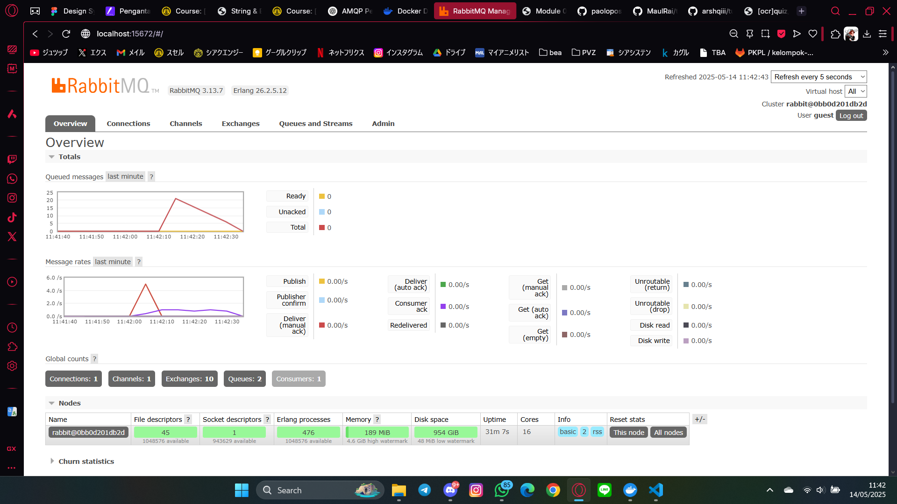
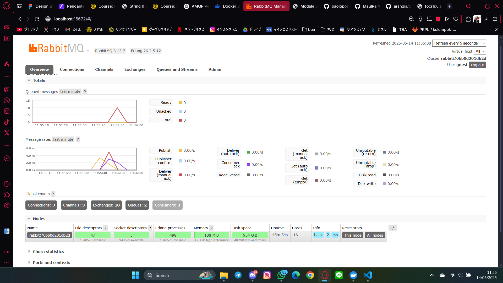

a. What is amqp?

> AAMQP (Advanced Message Queuing Protocol) adalah sebuah protokol open-standard yang dirancang untuk memungkinkan sistem perangkat lunak berkomunikasi satu sama lain melalui pesan, terlepas dari bahasa pemrograman atau platform yang digunakan. AMQP biasa digunakan dalam sistem antrian pesan (message queue) seperti RabbitMQ, yang mendukung komunikasi asynchronous antar layanan dalam arsitektur microservices atau event-driven. AMQP menjamin pengiriman pesan yang andal dengan fitur seperti queue, routing, publish/subscribe, dan transaksi.

b. What does it mean? guest:guest@localhost:5672 , what is the first guest, and what
is the second guest, and what is localhost:5672 is for?

Pada string koneksi guest:guest@localhost:5672, bagian pertama "guest:guest" menunjukkan username dan password yang digunakan untuk mengautentikasi ke broker AMQP (misalnya RabbitMQ), dalam hal ini username-nya adalah "guest" dan password-nya juga "guest". Bagian "localhost:5672" menunjukkan bahwa koneksi dilakukan ke server RabbitMQ yang berjalan di komputer lokal (localhost) pada port 5672, yang merupakan port default untuk protokol AMQP. Kombinasi ini memungkinkan aplikasi terhubung ke message broker lokal menggunakan kredensial default.

### Simulation slow subscriber

Berdasarkan chart RabbitMQ di atas, jumlah Queued Messages mencapai angka 20. Hal ini terjadi karena saya menjalankan perintah `cargo run` pada publisher sebanyak 5 kali, di mana setiap eksekusi mengirim 5 pesan sekaligus. Dengan demikian, total ada 25 pesan yang dikirim. Karena subscriber menggunakan `thread::sleep(ten_millis);`, maka proses pengambilan pesan mengalami jeda, sehingga menghasilkan antrian sebanyak (5 - 1) × 5 = 20 pesan yang menumpuk di queue sebelum diproses.

### Reflection and Running at least three subscribers

Ada beberapa subscriber yang terhubung ke queue yang sama dan saling berbagi beban dalam memproses pesan. Setelah itu, di direktori publisher, kita bisa mengetik cargo run beberapa kali untuk mensimulasikan banyaknya request masuk. Hasilnya, spike pada chart jumlah pesan di antrean (queued messages) akan turun lebih cepat dibanding sebelumnya. Hal ini terjadi karena RabbitMQ mendistribusikan pesan ke subscriber secara merata (round-robin) jika mereka mendengarkan queue yang sama, sehingga pemrosesan pesan menjadi lebih efisien dan tidak menumpuk pada satu subscriber saja. Ini mencerminkan kekuatan arsitektur event-driven dalam hal skalabilitas dan parallel processing.